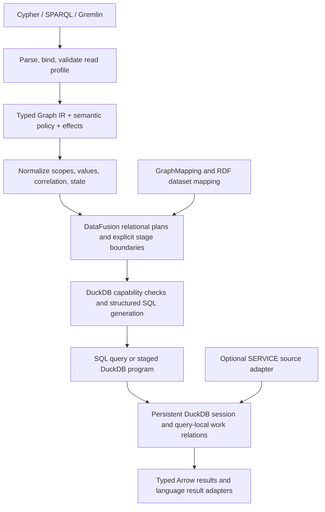

# Cypher, SPARQL, and Gremlin on DuckDB: read-query completion plan

Planning date: 2026-09-22. Source inspection: checkout at `d825869`, including
the working tree. This is an implementation plan, not a new conformance run.
All proposed module names and interfaces below are design targets unless
identified as existing.

Implementation checkpoint from the first parallel wave: the shared IR effect
validator and policy propagation, a query-local DuckDB stage runner, per-input
scalar/optional/coalesce lowering, an IRI-only RDF quad mapping with typed
`FROM`/`FROM NAMED` scopes, a public `RdfGraphEngine`, and an opt-in strict
read-only corpus profile are now in the working tree. Focused and integration
tests pass. This does not change the historical corpus percentages below or
complete the remaining work packages. In particular, richer RDF terms,
SPARQL property paths, general Gremlin traversal state, and full read-corpus
conformance remain open.

Second implementation wave: Cypher list comprehensions now plan through
`GraphUnwind`/`GraphCollect`, with relational collection lowering; uncorrelated
Gremlin inner apply resolves a duplicate `__path` column in favor of the inner
path; DuckDB programs have an optional whole-program deadline checked between
stages. A typed RDF quad source now carries kind, datatype, and language
identity through basic graph pattern joins and matches typed constants. Typed
RDF result terms and algebra paths that would lose identity still return
explicit unsupported errors. A no-run compile of all test targets passes
after correcting type errors reported by the initial compile. No tests were
run in this wave. List element order without an explicit sort key remains
unresolved in relational `GraphCollect`.

Integration note: a debug-build mapped Gremlin smoke test currently overflows
the default Rust test-thread stack during SQL preparation. It passes with
`RUST_MIN_STACK=16777216`; CI sets that value for integration tests. Reducing
SQL plan/unparser depth remains release work, and the larger stack is not a
production execution guarantee.

The objective is complete, correct read-query execution on DuckDB across the
three language profiles defined below. The critical work is preserving language
semantics through relational lowering, not merely accepting more syntax. Keep
the shared Graph IR, strengthen its semantic contracts, and let DuckDB execute
both ordinary relational queries and explicitly planned iterative work.

This plan supersedes the priorities in older completion notes for this read-only
effort. It does not schedule graph mutations, SPARQL Update, DDL language support,
write procedures, transaction-write development, or PostgreSQL completion.

## 1. What “full coverage” means

Freeze a versioned feature manifest before claiming a percentage. A feature is
complete only when its syntax, validation, planning, DuckDB execution, typed
results, and required errors pass. A successful parse, an extension node in a
plan, or agreement with our interpreter is insufficient.

| Profile | Completion target | Separate compatibility surface |
| --- | --- | --- |
| Cypher reads | Pin an openCypher specification/TCK revision; cover its read clauses, expressions, functions, scopes, patterns, paths, and errors | Preserve and report existing Ladybug/Kuzu read extensions separately; do not equate that corpus with all Cypher dialects or GQL |
| SPARQL queries | SPARQL 1.1 Query over a complete configured RDF dataset: all query forms, algebra, expressions, datasets, and property paths | Federated `SERVICE` needs a source adapter and a separate execution classification; extension functions and entailment regimes require named profiles |
| Gremlin reads | Pin the TinkerPop version corresponding to the imported corpus; cover the standard declarative read traversal surface and declared provider features | Arbitrary Groovy/Java lambdas, custom strategies, and arbitrary provider procedures are plugin contracts, not implicitly supported language features |

Use the [openCypher resources and TCK](https://opencypher.org/resources/) to pin
the Cypher target. Pin Gremlin from importer provenance rather than assuming the
latest documentation matches our cases. A versioned
[TinkerPop reference](https://tinkerpop.apache.org/docs/3.7.3/reference/) is a
starting reference, not a declaration that the current corpus is version 3.7.3.

Read-only means no changes to the user's source graph or tables. Gremlin sacks,
`aggregate`, `store`, `groupCount`, and `cap` can modify query-local state and
still belong in scope. `CONSTRUCT` produces a result graph and also belongs in
scope. Temporary DuckDB work relations are permitted implementation state;
they must be isolated and cleaned up. Fixture loaders may populate test data.
Sequence advancement, external writes, and write-capable procedures are excluded.

Declare three execution classes:

- **DuckDB query:** one SQL statement, including recursive CTEs.
- **DuckDB program:** multiple planned SQL stages with state in DuckDB; the host
  schedules stages and checks termination but does not interpret traversers.
- **Federated query:** remote sources provide bindings and DuckDB performs local
  relational work. Never report this as entirely executed inside DuckDB.

The first two satisfy local DuckDB completion. The third is required before
claiming the complete federated SPARQL profile. Finite valid queries must return
complete answers within their resource budget or fail explicitly. Nonterminating
Gremlin walks do not have a finite complete answer; cancellation is not a pass.

## 2. Starting point and concrete gaps

### Historical measurements, not today's baseline

The last documented full relational measurements are in
[language_coverage_review.md](language_coverage_review.md), dated 2026-08-31:

| Measurement | Cypher | Gremlin |
| --- | ---: | ---: |
| Imported cases | 5,593 | 1,709 |
| Runnable cases | 5,446 | 1,667 |
| Lowered to relational work | 4,816 | 888 |
| Executed in DuckDB | 4,634 | 782 |
| Matched expected output | 3,392 | 578 |
| Matched / runnable | 62.3% | 34.7% |
| Missing harness data | 147 | 42 |

The same review reports 1,584/1,667 Gremlin interpreter matches. That is not
DuckDB coverage. These imported denominators also predate this explicit read-only
manifest; retain them for comparison while establishing the new denominator.

[sparql_coverage.md](sparql_coverage.md) reports 408/425 parsed queries and
408/408 planned queries, with 346 plans free of extension nodes. Its DuckDB
expected-output matrix has only six queries. There is no demonstrated full W3C
execution denominator. Do not extrapolate from those six queries.

### Source findings

| Area and existing code | Finding | Required direction |
| --- | --- | --- |
| [engine.rs](../src/engine.rs), [mapped_engine.rs](../src/mapped_engine.rs) | Managed persistence, typed Cypher parameter binding, SQL-only reads, and persistent DuckDB sessions already exist. Managed reads can still reconstruct/materialize a `PropertyGraph`; mapped reads use existing tables | Build on the mapped SQL read path; do not restart the obsolete “no persistence/no parameters” tasks |
| [rel/mod.rs](../src/ir/rel/mod.rs) | Roughly 8,500 lines combine scans, expressions, values, correlation, traversal, and aggregates. Lowering context retains `Language`, not the whole plan policy; several operator policy fields are ignored in dispatch | Split ownership seams and preserve policy/state contracts through every lowering |
| `lower_apply`, `lower_coalesce` | Scalar and optional apply share a left-join implementation; coalesce accepts only two arms with a pass-through fallback | Explicit cardinality and correlation; general per-input productive branch selection |
| `lower_repeat`, [varlen.rs](../src/ir/rel/varlen.rs) | Repeat has an eight-iteration unroll limit and rejects termination/path shapes. Variable expansion already has recursive lowering; Gremlin recursive path materialization is declined | Extend existing recursion; do not describe all paths as capped or already solved |
| `lower_node` | Read operators including `GraphShortestPath`, `GraphSelect`, `GraphCap`, `GraphCollect`, `GraphListComprehension`, and SPARQL-specific nodes lack general dispatch | Inventory variants and expression calls; add typed lowerings and end-to-end tests |
| [SPARQL planner](../src/language/sparql/mod.rs) | Ontology BGP lowering needs a typed root and handles limited variable/property/relationship patterns. It does not pass graph scope into `lower_ontology_bgp`; several recursive lowering calls reset scope | Introduce general dataset-aware RDF scans and preserve scope through every algebra wrapper |
| SPARQL planner and [terms.rs](../src/language/sparql/terms.rs) | Group/dataset/reduced plans use extensions; RDF values are collapsed into strings/scalars; decimal literals can pass through floating point | Typed RDF terms, typed operators, and SPARQL expression/error semantics |
| [value.rs](../src/ir/value.rs), [policy.rs](../src/ir/policy.rs) | `Unproductive`, arbitrary precision numbers, and language policies already exist, but `Null` also represents SPARQL unbound | Extend existing types and preserve distinctions across SQL and Arrow rather than reimplementing them |
| [SQL backend](../src/ir/rel/sql/mod.rs), [recursive SQL](../src/ir/rel/sql/recursive.rs) | DataFusion unparsing has string fixups and special CTE wrappers; ordered aggregates and scope barriers need special treatment | Structured SQL transformations, explicit capability checks, stable scope handling |
| [DuckDB executor](../src/ir/rel/sql/duckdb_exec.rs) | Persistent connections, setup caching, interrupt/timeouts, and exact-number transport exist; result conversion is still a narrow intermediate representation | Complete typed result transport, streaming, and whole-query budgets |
| [CI](../.github/workflows/ci.yml), [corpus runner](../tests/graph_rel_backend_cases.rs) | CI runs selected integrations, not a strict complete three-language read denominator. The relational corpus runner fails coverage gaps only with `GRAPH_REL_STRICT=1` | Reproducible manifests, expected-result gates, and explicit no-regression enforcement |

Recheck historical failures before making tickets. Wide integer, distinct,
parameter, and recursion regressions already have dedicated tests. An old
unchecked checklist entry is not proof that the bug still exists.

## 3. Target architecture and contracts



### 3.1 Keep Graph IR; stop losing semantic information

Extend the current IR with a typed binding schema. Each binding needs its logical
type, nullability/boundness, identity domain, visibility, and physical column
mapping. Plans also need cardinality, ordering requirements, multiplicity, and
effects. Keep the full `GraphPlanPolicy` available to lowerers.

Replace dependencies on names such as `__id`, hidden correlation prefixes, and
magic alias prefixes with explicit metadata, retaining physical names only as
an encoding detail. Mark each operator as pure, query-stateful, external-read,
or source-mutating. Validate effects recursively, including branch bodies,
subqueries, repeat modulators, and procedures, before any query executes.

New typed IR forms must be supported by plan formatting, `ir/df.rs` round-trips,
rewrites, traversal utilities, validation, and capability reporting. Do not use
`GraphExtension { metadata: algebra_as_text }` as the executable representation
for a standard feature. No planner should declare success by inserting a null
placeholder for an algorithm or unknown function.

### 3.2 One lossless value contract, with language-specific operations

Design a versioned logical-to-Arrow-to-DuckDB encoding before adding more casts:

- Distinguish a bound null, an unbound variable, an unproductive traversal, and
  an expression error. Productivity is a row/traverser property; it must not be
  inferred from whether a payload happens to be SQL NULL.
- Preserve integer width, arbitrary precision values, decimal scale, temporal
  values, binary data, lists, maps, sets, nodes, edges, paths, and property objects.
  Use native DuckDB types when lossless; otherwise use an explicit tagged
  representation and exact operations. Do not route exact values through `f64`.
- RDF terms require kind, lexical form, datatype, language, and blank-node scope.
  Keep term identity separate from numeric/string value comparison. A formatted
  string is not the stored representation of an RDF term.
- Element identity needs a stable namespace independent of scan order and label
  display. Preserve parallel edges, multi-label identity, and mapped IDs outside
  the current integer-only assumptions. Stable surrogate keys may map external
  string/composite IDs into relational joins without changing public identity.
- Function signatures declare coercion, error behavior, volatility, and language
  profile. Lazy conditionals must not eagerly evaluate failing unused branches.
  Use SQL expressions/macros or registered DuckDB functions where necessary;
  scalar functions must not conceal a row-by-row graph interpreter.

The existing interpreter remains a diagnostic reference. It is not the semantic
authority when an official expected result disagrees with it.

### 3.3 Correlation and relational algebra

Represent per-input-row identity explicitly, including duplicate outer rows.
Plan correlated aggregation, ordering, limits, collection, and scalar subqueries
per outer row, not globally. Enforce the scalar cardinality contract when more
than one row is produced. Support arbitrary coalesce/choose arms using productive
results per input, preserving required multiplicity and order.

SPARQL solution compatibility requires its own lowering; an ordinary equijoin or
SQL `NOT IN` is not a general substitute. Preserve boundness through OPTIONAL,
UNION, VALUES, projection, and negation. Verify `MINUS` with disjoint variable
domains independently from correlated `NOT EXISTS`.

Aggregate lowering must select each language's empty-input, null/error, distinct,
and bulk rules. Optimizer rules must respect these contracts. Decorrelate and
push filters only when legal; fence error-sensitive, volatile, stateful, and
order-sensitive regions.

### 3.4 Recursion and query-local state

Build on the current recursive DataFusion plan and CTE emitter. Share the
recursion machinery, not a universal path semantic:

| Language | State the engine must preserve |
| --- | --- |
| Cypher | Source-row identity, current endpoint, relationship uniqueness at the correct match scope, depth, ordered path elements, shortest-path frontier/ties |
| SPARQL | Active graph, start/end terms, path automaton state, and operator-specific multiplicity; reachability closure must terminate on cycles without counting every possible walk |
| Gremlin | Current object, bulk, path objects and labels, label history, nested loop counters, sack, correlation identity, emit/until placement, and query-local side-effect state |

Endpoint deduplication is valid for some reachability operators and incorrect
for enumerated Cypher paths or Gremlin traversers. A generic “visited vertex” set
would lose valid answers. Carry path/history only when downstream semantics need
it, but prove that need through dataflow analysis; the current
`tolerate_internal_path_state` option is not a sufficient correctness argument.

For recursive bodies expressible in one statement, emit recursive SQL. For
global barriers, cross-iteration deduplication, nested repeat state, and graph
algorithms, introduce a `DuckDbProgram` with typed SQL stages, work schemas,
termination predicates, and cleanup. Keep state and relational processing in
DuckDB. The host may read a termination flag; it must not enumerate the frontier
and interpret each traverser. A registered DuckDB operator is a possible later
optimization after profiling, not an initial substitute for a defined contract.

This explicitly changes two older design constraints: “one complete SQL query”
in [sql_islands_completion.md](sql_islands_completion.md) becomes “a complete
DuckDB query/program,” and the single-plan-only placement guidance in
[graph_relational_backend.md](graph_relational_backend.md) gains a stage scheduler.
DataFusion remains the relational representation within each stage. There is no
second general graph interpreter below it.

Separate semantic bounds (`times(12)`, `*1..20`) from execution budgets. A budget
must interrupt with a classified error rather than return a truncated success.
Validate against the bundled DuckDB version; do not assume newer recursive SQL
features are available just because current online documentation describes them.

### 3.5 SPARQL needs a complete virtual RDF dataset

The existing two-level mapping remains valuable:
`OntologyMapping -> GraphMapping -> DuckDB tables/views`. Extend it into a
dataset abstraction that can enumerate RDF statements as well as optimize known
predicates. A canonical relational interface can expose
`(graph, subject_term, predicate_term, object_term)` through views/unions; it does
not require a separate RDF database or physically materializing every triple.

Mappings must describe IRI/blank-node construction, literal types/languages,
default and named graphs, null omission, and duplicate triple elimination within
each graph. They must support variable predicates, constants, disconnected BGPs,
repeated variables, untyped subjects, and multiple sources for one predicate.
An unrecognized predicate over a complete configured dataset yields no matches;
an invalid mapping configuration is a different error.

Add a generic relation adapter for user-owned triple/quad-shaped tables, also
usable by the W3C fixture loader. This extends the current documented restriction
that the project provides no such adapter; it is read-source support, not a
new storage/mutation project. Pure ontology-star lowering cannot deliver general
SPARQL query coverage.

Replace `SparqlGroup`, dataset, and reduced text extensions with executable
typed algebra. Preserve active graph scope across subqueries and all wrappers.
Implement typed expression results and every declared built-in family. Complete
ASK, CONSTRUCT, and a documented DESCRIBE policy, including graph-result comparison.
These requirements follow the
[SPARQL 1.1 Query specification](https://www.w3.org/TR/sparql11-query/).

`SERVICE` is a distinct external source stage with endpoint resolution, request
batching, binding compatibility, remote blank-node scoping, failure semantics,
and `SILENT`. Use deterministic local endpoint fixtures. Failure must not be
silently converted into an empty result without applying the specified algebra.
See [SPARQL 1.1 Federated Query](https://www.w3.org/TR/sparql11-federated-query/).

### 3.6 Gremlin needs traverser execution semantics

Use an explicit traverser relation. Bulk affects count, reduction, barriers, and
expansion; it is not merely a final formatting field. Labels/history, property
objects, vertex multi-properties, and meta-properties need real data support.
Sack split/merge operations and side-effect reducers must have defined isolation
and ordering. Preserve local versus global scope for sorting, slicing, grouping,
deduplication, and child traversals.

Complete repeat before claiming algorithms or complex `match` correctness.
Graph-computer algorithms need actual iterative implementations over query-local
relations; never substitute placeholder rank/component values. Keep provider
scan-order compatibility separate from ordering guaranteed by the language.
SQL scan order is not an ordering guarantee. See the versioned
[TinkerPop traversal reference](https://tinkerpop.apache.org/docs/3.7.3/reference/)
for the traversal-state and barrier contracts.

### 3.7 SQL generation, storage access, and results

Split SQL generation into capability validation, relational rewrites, structured
SQL emission, and execution. Replace broad text substitution with AST-level or
explicit emitter rules. Preserve CTE dependency order, nested correlation scopes,
aggregate ordering, and recursive worktable types.

Promote `PreparedSql` toward a typed prepared query/program with parameters,
result schema, source dependencies, execution class, and budgets. Existing
Cypher AST parameter binding is functional; extend it to reusable DuckDB prepared
parameters and plan caching without changing semantics. Cache keys must include
mapping/schema versions and semantic profile.

Make mapped tables/views the primary scalable read path. Managed reads need a
separate design to expose existing persisted data as SQL-readable relations,
without reconstructing and re-inserting the entire graph per snapshot. This may
require a read projection or table function over the current storage format;
choose that implementation after measuring it. No new public write features are
required for this work.

Complete nested result transport and move display formatting to language result
adapters. Stream Arrow batches instead of collecting every query into one batch.
Cover SELECT tables, Gremlin streams with multiplicity, ASK booleans, and RDF
graph results. Add whole-query cancellation across compilation/setup/stages and
stream consumption, memory/temp-storage budgets, and snapshot consistency across
stages. Query-local state must not leak after success, failure, or cancellation.

## 4. Subagent work packages

The coordinator owns the dependency graph, shared contracts, merge queue, and
full regression reports. Assign one package or one numbered slice of a package
per subagent. Avoid “finish Gremlin” or “fix all SQL failures” assignments.

Dependencies below refer to merged contracts; later refinements should not
force unrelated agents to wait for an entire feature family to finish. Split
large packages at the numbered deliverables, each with its own reviewable patch.

| ID / priority | Deliverables and scope | Owned paths (new paths are proposed) | Depends on | Acceptance evidence |
| --- | --- | --- | --- | --- |
| A0 / P0 | 1. Pin language/corpus versions and read-only feature manifest. 2. Re-run baseline and classify every gap by phase and semantic family. 3. Add strict regression comparison | `tests/graph_rel_backend_cases.rs`, `scripts/run-rel-coverage.sh`, proposed `tests/conformance/manifest.*` | None | Stable case IDs, reproducible totals, read/write classification, missing fixtures counted, phase-specific expected errors; no silent case deletion |
| A1 / P0 | 1. Mechanical extraction of relational lowering modules. 2. Introduce binding metadata, full policy propagation, effect/capability contracts, and exhaustive walkers | `src/ir/{plan,policy,df}.rs`, `src/transform/`, `src/ir/rel/mod.rs`; proposed `rel/{context,bindings,capabilities}.rs` | None; coordinate manifest vocabulary with A0 | Existing focused tests and baseline unchanged for mechanical extraction; IR round-trip tests and nested mutation rejection for contract changes |
| A2 / P0 | 1. Lossless value/Arrow/SQL encoding. 2. Function signatures, error and coercion profiles. 3. Exact/nested transport | `src/ir/{value,expr}.rs`; proposed `src/ir/types/`, `rel/{values,functions}.rs` | A1 contracts | Null/unbound/unproductive/error remain distinguishable; exact-number and nested-value round trips; mixed-type ordering and lazy-error tests |
| A3 / P0 | 1. Source mapping and identity contracts. 2. Multi-label and parallel-edge correctness. 3. External/composite IDs and property-object source schema | `src/ir/rel/mapping.rs`; proposed `rel/scans.rs` | A1, A2 encoding contract | Same entity through multiple labels remains one identity; parallel edges remain distinct; joins through mapped views preserve identity and missing properties |
| A4 / P0 | 1. Correlated apply/cardinality. 2. General choose/coalesce. 3. Local limits, collects/comprehensions, aggregation and union alignment | proposed `rel/{apply,branch,collections,aggregate}.rs` | A1, A2 | Duplicate outer rows, empty children, nested correlation, per-row limits/aggregates, scalar multi-row error, null-valued productive branches |
| A5 / P0 | 1. Structured SQL fixes and capability reporting. 2. Typed prepared program and parameters. 3. Session scheduler, cleanup and stage cancellation | `src/ir/rel/sql/{mod,recursive,duckdb_exec}.rs`; proposed `sql/{emit,program}.rs` | A1; A2 encoding contract for transport | DuckDB execution for nested CTE/scopes; prepared values cannot change query structure; staged program cleanup and snapshot/cancellation tests |
| A6 / P0 | 1. Shared recursive work schema. 2. Extend Cypher varlen/path materialization. 3. Shortest-path search and tie contracts | `src/ir/rel/varlen.rs`; proposed `rel/{recursion,paths}.rs` | A1–A3; A5 for staged search | Cycles, self-loops, parallel edges, zero-hop, reverse/undirected, repeated input rows, paths longer than old limits, correct shortest ties |
| C1 / P1 | 1. Cypher scope/binding validation and remaining read syntax. 2. OPTIONAL/subqueries/UNION/UNWIND. 3. Lists, maps, quantifiers, pattern expressions and read functions | `src/language/cypher/`, `tests/cypher_*` excluding shared harness ownership | A1, A2, A4; A6 for path slices | Pinned read TCK and extension suites pass in DuckDB; proper errors for invalid scopes/types; no runtime-only additions |
| S1 / P0 | 1. Typed RDF term contract. 2. General virtual RDF dataset and source adapter. 3. Scope-safe BGP planning | `src/language/sparql/{ontology,terms}.rs`; proposed `src/ir/rdf/`, `rel/rdf_scan.rs` | A1–A3 | Variable predicates, constants, repeated variables, disconnected patterns, no explicit type, named graphs, same spelling/different term kinds, typed literals |
| S2 / P1 | 1. Typed SPARQL algebra and compatibility joins. 2. Expressions/errors and aggregates. 3. Subqueries, VALUES, OPTIONAL, MINUS/EXISTS, modifiers | `src/language/sparql/{mod,expression}.rs`; proposed `rel/sparql.rs` | A2, A4, S1 | W3C expected bindings, including unbound and error cases; OPTIONAL filter placement; disjoint-domain MINUS; grouped empty input |
| S3 / P1 | 1. Property-path automaton. 2. Graph/dataset scope and zero-length rules. 3. ASK/CONSTRUCT/DESCRIBE result planning | `src/language/sparql/path.rs`; proposed `rel/{rdf_paths,rdf_results}.rs` | A6, S1, S2 algebra contract | Alternative/inverse/negated/repeated paths with cycles; no extra closure multiplicity; ASK empty/nonempty; graph isomorphism and fresh template blank nodes |
| S4 / P2 | 1. SERVICE source-stage interface. 2. Fixed/variable endpoints and batched bindings. 3. SILENT/error/cancellation semantics | proposed `src/sources/sparql_service.rs`, `tests/sparql_service.rs` | S1, S2, A5 | Deterministic local federation suite; remote bindings retain types/scopes; execution metadata reports federation |
| G1 / P0 | 1. Traverser schema and productivity. 2. Labels/select/path and property objects. 3. Bulk, local/global map/filter/branch/group semantics | `src/language/gremlin/planner/lowering/` except G2/G3 files; proposed `rel/gremlin.rs` | A1–A4 | Null injection survives while unproductive children disappear; repeated labels, local slicing, `valueMap`/`elementMap`, multi/meta-properties, bulk-aware counts |
| G2 / P1 | 1. Repeat/until/emit and nested loops. 2. Sacks and side-effect reducers. 3. Barrier/dedup state across iterations | Gremlin `lowering/{repeat,side_effects}.rs`; proposed `rel/gremlin_state.rs` | G1 traverser contract, A5, A6 | All before/after emit/until combinations, times > 8, nested counters, empty seeds, sack split/merge, aggregate/store/cap, cross-loop dedup |
| G3 / P2 | 1. Match constraint planning and declared strategies. 2. Read graph algorithms. 3. Procedure capability validation | Gremlin `lowering/{match_step,procedures,subgraph_strategy}.rs`; proposed `rel/algorithms.rs` | G1, G2, A5, A6 | Reference answers for weighted shortest paths and declared algorithms/options; no placeholder properties; query-local state cannot persist |
| T1 / P0 | 1. Cypher scenario/schema fixtures and Gremlin missing datasets/import fixes. 2. W3C manifest/dataset/result runner. 3. Typed comparators | `tests/{cypher_case_runner,gremlin_case_runner}/`, import scripts; proposed `tests/sparql_case_runner/` | A0 schema; S1 adapter for SPARQL execution | Fixture provenance pinned; no expected-output-derived data; order/multiset/graph comparison is correct; missing manifests fail strict mode |
| E1 / P1 | 1. Uniform read compile/execute API and execution metadata. 2. Managed SQL read-source access. 3. Streaming and end-to-end budgets | `src/{engine,mapped_engine,storage}.rs`; result API additions coordinated with A2/A5 | A3, A5; language packages incrementally | Both APIs pass declared reads without interpreter calls; source data unchanged; persistent-session cancellation/reuse; bounded-memory streaming |
| V1 / P1 | 1. Integration regression gate. 2. Adversarial semantic and scale testing. 3. Performance/plan-growth review and release evidence | proposed `tests/conformance/`, `.github/workflows/ci.yml`, release reports | A0, T1; continuous after each merge | No lost passing cases; all manifest cases accounted for; strict final read profiles pass and report execution classes |

### Shared-file rules

1. A1 owns the initial `rel/mod.rs` extraction. Other agents prepare fixtures,
   reproducers, and contract proposals until their module exists. Do not have
   three language agents edit this file concurrently.
2. Only the contract owner changes `plan.rs`, `expr.rs`, `policy.rs`, `value.rs`,
   or result schemas in a given merge window. Consumers request a small contract
   patch; they do not invent competing null or identity encodings.
3. A5 owns `sql/mod.rs` and executor wiring. A2 supplies codec changes through a
   coordinated patch; E1 consumes the executor API after its contract lands.
4. S2 owns SPARQL planner dispatch. S1/S3 supply focused helper modules and ask
   S2 to wire them in. Apply the same rule to G1 versus G2/G3 Gremlin dispatch.
5. A0 owns manifest/report schema changes; T1 owns fixture loading. Tests added
   by feature agents live in separate focused files until integration.
6. Every agent works in an isolated worktree/branch. Merge and rebase at contract
   boundaries. Record the starting revision and avoid incorporating unrelated
   working-tree changes into a package.

### Suggested schedule with three workers and one coordinator

| Wave | Worker 1 | Worker 2 | Worker 3 | Coordinator gate |
| --- | --- | --- | --- | --- |
| 0 | A0 manifest/baseline | A1 mechanical split and contracts | T1 fixture/provenance audit | Agree profiles, effects, binding/value and report schemas |
| 1 | A2 codecs/functions | A3 source identities | A5 SQL/program interfaces | Merge contracts before consumers; preserve baseline |
| 2 | A4 correlation/algebra | A6 recursion/path core | S1 RDF dataset | Shared infrastructure passes actual DuckDB tests |
| 3 | C1 read-language slices | S2 algebra/expressions | G1 traverser semantics | Each language gets strict vertical slices |
| 4 | S3 RDF paths/results | G2 repeat/state | E1 integration/streaming | Complete local query and program execution |
| 5 | S4 federation | G3 strategies/algorithms | T1 final fixture closure and V1 | Full-profile gates and no-regression reports |

This is a dependency schedule, not a duration estimate. Split packages further
when a deliverable exceeds one focused review. The coordinator runs V1 throughout
and can reassign an available worker to corpus clusters after a contract merges.
Do not put all remaining semantic failures into one final cleanup assignment.

### Copyable assignment template

```text
Package and slice: <ID, numbered deliverable, semantic family>
Base revision and worktree: <revision/path>
Objective: <observable query behavior on DuckDB>
Owned files: <exclusive paths>; shared owner: <agent>
Dependencies/contracts: <merged revisions and exact interfaces>
Reproducer: <query, fixture, expected typed result or expected error phase>
Implementation: parser/IR/lowering/executor changes required for this slice
Out of scope: graph mutations, unrelated refactors, changing corpus expectations
Acceptance: <focused cases>, actual DuckDB execution, zero residual interpretation
Regression: affected full profile; preserve all previously passing case IDs
Deliver: patch, tests, generated SQL/explain evidence, before/after case transitions,
         remaining blockers, and any requested contract changes
```

## 5. Language completion checklists

These families must appear in the manifest even if absent from today's imported
cases. The manifest expands them into version-specific operators and functions.

| Cypher | SPARQL | Gremlin |
| --- | --- | --- |
| MATCH/OPTIONAL, labels/types, relationship uniqueness | BGPs, term matching, GRAPH/datasets | Sources, navigation, properties and property objects |
| WITH/RETURN, aggregation, DISTINCT, sorting and slicing | JOIN/OPTIONAL/UNION, BIND/VALUES, MINUS/EXISTS | Map/filter/flatMap, productivity, predicates and conversions |
| UNWIND, UNION, correlated read subqueries, existential patterns | Projection, modifiers, subqueries, grouping/HAVING | Choose/coalesce/union/optional/local and match constraints |
| Lists/maps, comprehensions, quantifiers, reduce, lazy expressions | All standard expression/function families and errors | Labels/select/path, simple/cyclic path filters, bulk |
| Fixed/variable paths, shortest paths, path functions | Property paths, including zero length and negation | Repeat/until/emit, nested loops, sacks and barriers |
| Numeric/string/temporal/spatial functions in the pinned profile | SELECT/ASK/CONSTRUCT/DESCRIBE; federation as declared | Group/fold/unfold/reduce/dedup/order/range/tail/sample/coin |
| Parameters, scope/type validation, declared read procedures | Blank nodes, language/datatype identity, exact numerics | Multi/meta-properties, declared strategies and graph algorithms |

Nondeterministic features need semantic or statistical assertions, seeded runs
where the profile permits them, and allowed-result checks. Do not invent a single
golden ordering for unordered results, `SAMPLE`, random traversals, or ties the
language leaves unspecified.

## 6. Validation and release gates

### Establish the real baseline

Existing commands, which report today's imported corpora rather than the future
read-profile denominator:

```sh
scripts/run-rel-coverage.sh cypher 4
scripts/run-rel-coverage.sh gremlin 4
cargo test --test sparql_smoke mapped_sparql_duckdb_execution_matrix -- --nocapture
```

Use `GRAPH_REL_EXEC=duckdb` for DuckDB claims. DataFusion and island/interpreter
cross-checks are diagnostic runs. The existing sharding script does not provide a
SPARQL conformance runner. A0/T1 must add that facility before reporting a combined
three-language percentage. Save reports with commit, manifest/corpus hashes,
profile, backend, limits, fixtures, and toolchain versions; the existing script
retains only its immediate predecessor.

For focused debugging, existing controls include `GRAPH_REL_SUITE`,
`GRAPH_REL_LIMIT`, and `GRAPH_REL_OUTPUT_DIR`. `GRAPH_REL_STRICT=1` turns reported
relational failures into a failing run; the current broad corpus is expected to
fail until its gaps close. Intermediate CI should fail on lost passing cases
and new slice regressions, then switch completed profiles to all-cases strict.

Run relevant focused tests before a full profile sweep. Existing regression
anchors include `cypher_parameters`, `distinct_semantics`,
`wide_integer_predicates`, `recursion_limits`, `repeat_semantics`,
`recursive_cte_support`, `mapped_engine`, `byos_smoke`, and `sql_backend_smoke`.

### Required reporting

Report independently for each language/profile:

- Total declared read cases; fixtures available/missing; explicit excluded writes
  and provider extensions, with reasons. Keep exclusions visible and versioned.
- Parse, validate/plan, lower, prepare, execute, and typed-result comparison
  outcomes. Expected errors pass only at the appropriate phase/category;
  “unsupported” is not a substitute for an expected semantic error.
- Correct expected results / all declared in-scope cases; missing fixtures remain
  incomplete, not silently removed. Also report runnable accuracy for diagnosis.
- Single-query DuckDB, staged DuckDB, federated, and residual interpreter counts.
  Zero residual interpretation is necessary but does not prove correct answers.
- SQL/interpreter agreement separately from external expected-result accuracy;
  exact case transitions and regressions, not just a net pass-count change.
- Setup, compile, execution, and result-conversion timeouts separately, plus
  resource-limit failures and result-stream cancellation.

Compare ordered results only when ordering is required; otherwise compare bags
or sets as specified. Compare RDF graphs modulo blank-node renaming. Validate
types and identity independently of display text. Use published expectations and
pinned reference engines where appropriate; never seed fixtures from expected
answers or make the current interpreter the sole oracle.

### Milestones

1. **M0 — measurable:** pinned manifests, restored fixtures with provenance,
   new baseline, assigned blockers, explicit standards/provider profiles.
2. **M1 — sound shared execution:** lossless values, policy/effect propagation,
   correlation, SQL scopes, and result contracts pass adversarial DuckDB tests.
3. **M2 — complete local core:** each language's declared non-stateful read
   surface passes actual DuckDB expected-result tests; general RDF datasets work.
4. **M3 — complete recursive/stateful reads:** path, repeat, bulk, side effects,
   and declared algorithm suites pass with no unroll-based semantic ceiling.
5. **M4 — complete declared profiles:** zero unexplained skips or unsupported
   in-scope features; all expected results/errors pass; federation has its own
   passing gate; no regressions in existing extension profiles.
6. **M5 — production read path:** supported reads default to DuckDB, snapshots
   stay consistent across stages, streaming and cancellation work, scale tests
   avoid full in-memory graph reconstruction, and coverage reports are strict CI
   artifacts. Preserve a diagnostic interpreter until independent oracles cover
   its replacement.

Remove heuristic plan-size/shape rejection only after replacing it with measured
resource controls and bounded compiler behavior. Do not trade correctness for
a better pushdown percentage. Full language coverage is a claim about the pinned
semantic surface, not a claim that every possible query finishes within a fixed
budget.
